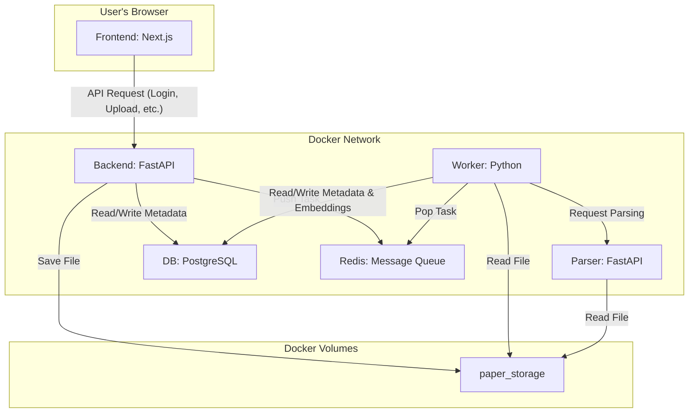

# システム概要と開発再開ガイド

この資料は、開発を2ヶ月ぶりに再開する開発者が、システムの全体像、主要なデータフロー、および動作確認方法を迅速に理解することを目的としています。

## 1. システム構成

本システムは、Docker Composeによって管理される複数のサービスから構成されています。

-   **`frontend`**: Next.jsによるWebフロントエンド。ユーザーインターフェースを提供します。( `http://localhost:3000` )
-   **`backend`**: FastAPIによるAPIサーバー。ビジネスロジック、認証、タスクの受付を担当します。( `http://localhost:8000` )
-   **`parser`**: PDF等のファイルからテキストを抽出する責務を持つ、独立したFastAPIサービスです。
-   **`worker`**: `backend`からRedisを通じてタスクを受け取り、時間のかかる処理（テキスト抽出、AIによる解析など）を非同期で実行するPythonプロセスです。
-   **`db`**: PostgreSQLデータベース。`pgvector`拡張機能が有効化されており、ベクトル検索（RAG）が可能です。
-   **`redis`**: `backend`と`worker`間のタスクキューとして機能するインメモリデータベースです。
-   **`paper_storage`**: アップロードされた論文ファイルを永続化するためのDocker Volumeです。



## 2. 主要なデータフロー

### 2.1. 起動シーケンス

1.  `make up` (または `docker-compose up -d`) を実行すると、`docker-compose.yml` に定義された全サービスが起動します。
2.  **`db`**: PostgreSQLサーバーが起動します。
3.  **`backend`**:
    -   起動時に `pgvector` 拡張機能の存在を確認し、なければ作成します (`CREATE EXTENSION IF NOT EXISTS vector`)。
    -   次に、Alembicを利用してデータベースマイグレーションを自動で実行し、テーブルスキーマを最新の状態に保ちます (`alembic upgrade head`)。
    -   最後にDBの接続性、`pgvector`、主要テーブルの存在をチェックする診断が実行され、結果がコンソールに出力されます。
4.  **`worker`**: `backend`や`db`の準備が整った後、Redisキューの監視を開始します。

### 2.2. 論文アップロードと解析フロー

1.  **Frontend**: ユーザーが `/dashboard` から論文ファイル(PDF)をアップロードします。
2.  **Backend**: `/papers/upload` エンドポイントがファイルを受け取ります。
    -   ファイルを共有ボリューム `paper_storage` に保存します。
    -   データベースに `papers`, `versions`, `files` などのメタデータを作成します。
    -   `inference_tasks` テーブルに `status='Pending'` のタスクを作成します。
    -   このタスクIDをRedisキューに `rpush` します。
3.  **Worker**: Redisキューを `blpop` で監視しており、新しいタスクIDを取得します。
    -   DBのタスクステータスを `Processing` に更新します。
    -   `parser` サービスにファイルのテキスト化をリクエストします。
    -   (MOCK_MODE=falseの場合) 抽出したテキストからEmbedding（ベクトル表現）を生成し、`pgvector` を利用してDBに保存します。
    -   (MOCK_MODE=falseの場合) LLM（Ollamaなど）に解析を依頼します。
    -   最終的な結果をDBに保存し、タスクステータスを `Completed` に更新します。
4.  **Frontend**: `useTaskStatus` フックなどが定期的に `backend` のタスクステータスエンドポイントをポーリングし、進捗をUIに反映します。

### 2.3. ホーム画面 (ログイン)

1.  **Frontend**: ユーザーがトップページ (`/`) にアクセスします。
2.  `「デモを開始する」` ボタンをクリックすると、`backend` の `/auth/demo-login` エンドポイントにリクエストが送られます。
3.  **Backend**: 固定のデモユーザー情報でJWTアクセストークンを発行します。
4.  **Frontend**: 受け取ったトークンをCookieに保存し、`/dashboard` へリダイレクトします。

## 3. ログの仕様

-   **出力方法**: 各サービスは、ログをコンテナの**標準出力**に書き出します。
-   **確認方法**:
    -   全サービスのログをまとめてリアルタイムで見る:
        ```bash
        make logs
        # または
        docker-compose logs -f
        ```
    -   特定のサービスのログだけを見る (例: `backend`):
        ```bash
        docker-compose logs -f backend
        ```
-   **ログファイル**: `make up` または `make debug-up` を実行すると、プロジェクトルートに `logs.txt` が生成され、バックグラウンドでログが追記され続けます。

## 4. 動作確認方法

### 4.1. 起動と停止

-   **通常起動**:
    ```bash
    make up
    ```
-   **デバッグモードで起動** (テストコードがマウントされる):
    ```bash
    make debug-up
    ```
-   **停止**:
    ```bash
    make down
    ```
-   **完全クリーンアップ** (DBデータ含む全リソースを削除):
    ```bash
    make clean
    ```

### 4.2. サービスの稼働状態確認

-   以下のコマンドで、全コンテナの `Status` が `running` または `Up` になっていることを確認します。
    ```bash
    make ps
    # または
    docker-compose ps
    ```

### 4.3. フロントエンドへのアクセス

-   ブラウザで `http://localhost:3000` を開きます。
-   「デモを開始する」ボタンをクリックして、ダッシュボード画面に遷移できれば正常です。

### 4.4. システム診断スクリプトの実行

-   システム間の連携（API疎通、DB接続、Redis接続など）をチェックするための診断スクリプトが用意されています。
-   **デバッグモードで起動後**、以下のコマンドを実行します。

    ```bash
    make test
    ```
-   このコマンドは `backend` コンテナ内で `tests/run_diagnosis.py` を実行し、各サービスのヘルスチェックAPIを叩いて接続性を確認します。

## 5. 開発を再開する上でのTips

-   **データベースのマイグレーション**: `backend/app/models.py` を変更した際は、新しいマイグレーションファイルを作成する必要があります。
    ```bash
    # 1. メッセージを入力してリビジョンファイルを作成
    make revision

    # 2. コンテナを再起動すると自動でマイグレーションが適用される
    make restart
    ```
-   **環境変数**: データベースのパスワードやAPIキーなどの設定は、`.env.example` をコピーして作成した `.env` ファイルで管理されています。
-   **Ollama (LLM)**: `docker-compose.yml` 内で `ollama` サービスはコメントアウトされています。ローカルでLLMを使ったテストを行う場合は、コメントを解除し、初回に `make setup-ollama` を実行してモデルをダウンロードしてください。
